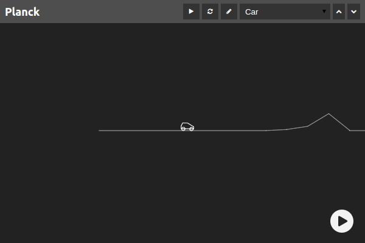

# Planck.js<sup>&alpha;</sup>

Planck.js is JavaScript rewrite of Box2D physics engine for cross-platform HTML5 game development. **[Check out demos!](http://piqnt.com/planck.js/)**

[](http://piqnt.com/planck.js/Car)

## Motivations

Key motivations for the development of this project are:
- Taking advantage of Box2D's efforts and achievements
- Developing readable and maintainable JavaScript code
- Optimizing the library for web and mobile platforms
- Providing a JavaScript-friendly API

## Try it

To try Planck.js, simply add `planck-with-testbed.js` script to your HTML code and call `planck.testbed(callback)` with your code in callback. For example:

```html
<html><body>
  <script src="https://cdn.jsdelivr.net/npm/planck-js@0.2/dist/planck-with-testbed.js"></script>
  <script>
    planck.testbed(function(testbed) {
      var world = planck.World();
      // rest of your code
      return world; // make sure you return the world
    });
  </script>
</body></html>
```

Check out [Car example on JS Bin](http://jsbin.com/nujuxik/edit?html,output) to try it in practice.
Also see [`example`](./example/) directory for more testbed usage examples.


## Install

*To receive updates about changes and progress follow [@piqnt on twitter](https://twitter.com/piqnt).*

#### Download

Latest builds are available on [releases page](https://github.com/shakiba/planck.js/releases).

#### CDN

Planck.js is [available on jsDelivr](https://www.jsdelivr.com/projects/planck).


#### NPM

    npm install planck-js --save

#### Bower

    bower install planck-js --save


## API

Planck.js public API closely follows Box2D API (see [Resources](#Resources)), with the following differences:

- `b2` prefix is dropped from class names, for example `b2World` is now available as `planck.World`.
- Method names are converted from UpperCamelCase to lowerCamelCase.
- Definition classes/objects (BodyDef, FixtureDef, etc.) are replaced by inline JavaScript objects (`{}`).
- Shapes are made immutable and are not cloned when used to create fixtures.
- `World#on(eventName, listenerFn)` and `World#off(eventName, listenerFn)` are added to add and remove event listeners. Currently supported events are:
    - `'begin-contact'`
    - `'end-contact'`
    - `'pre-solve'`
    - `'post-solve'`
    - `'joint-removed'`
    - `'fixture-removed'`
    - `'body-removed'`


## Resources and References
- <a href="http://box2d.org/documentation/" target="_blank">Box2D Manual</a> and <a href="https://github.com/erincatto/Box2D/wiki/FAQ" target="_blank">FAQ</a> are highly recommended to get started.
- [iforce2d](https://www.iforce2d.net/b2dtut/) website includes a collection of helpful tutorials and resources to learn Box2D.

Following resources are recommended if you are interested in learning about Box2D/Planck.js's internal details.

- [Continuous Collision](http://twvideo01.ubm-us.net/o1/vault/gdc2013/slides/824737Catto_Erin_PhysicsForGame.pdf) by Erin Catto (slides)
- [Solving Rigid Body Contacts](http://www.richardtonge.com/presentations/Tonge-2012-GDC-solvingRigidBodyContacts.pdf) by Richard Tonge (slides)
- [dyn4j Blog Posts](http://www.dyn4j.org/category/gamedev/) by William Bittle


## Tutorial

_This tutorial is under development, please feel free to edit, comment or ask for new sections._

Before writing code there are a number of key concepts to learn:

- **Shape** - A shape contains geometrical information and is used in collision detections.
- **Fixture** - A fixture consists of a shape and physical properties such as density.
- **Body** - Each body is composed of a number of fixtures which are fixed together, that is a body is a set of shapes with physical properties. Bodies have position, angle, linear velocity, angular velocity, etc. which can be changed by applying linear and angular forces or impulses. Bodies represent rigid objects in the world, such as ground, a box or a car.
- **Joint** - Joints are constraints on bodies position or velocity.
- **Contact** - When two bodies touch each other (are colliding) a contact between them is created.
- **World** - A world is composed of a number of bodies and joints interacting with each other. Every time world’s step() function is called, world solver will detect any contact between bodies and then change bodies position and velocity according to velocity, forces, contacts, and joints constraints.

A physics simulation in Planck starts by creating a World and adding Bodies and Joints. So let’s create our world:

```js
var world = planck.World();
```

This will create a world with default options. You can pass a definition object as first argument to World constructor, for example:

```js
var world = planck.World({
  gravity: Vec2(0, -10)
});
```
Bodies are directly created and added to world:

```js
var ground = world.createBody();
```

This will create a body with default options, which means a ‘static’ body at position 0, 0 with no velocity. You can pass a body definition object to change it:

```js
var ground = world.createBody({
  type: 'static',
  position: Vec2(2, 5),
});
```

After creating a body, you can create a fixture using a shape:

```js
ground.createFixture({
  shape: planck.Edge(Vec2(-40.0, 0.0),Vec2(40.0, 0.0))
});
```


## Rendering and Integration

Planck.js does not use any renderer by default. To use or integrate it with a rendering library all you need to do 
is call `world.step(timeStep)` in each frame, and then iterate over world entities to draw or update them.
You may also want to listen to world events to remove objects which are removed from the world. For example:

```html
<script src="./path/to/planck.min.js"></script>
<script>
  var world = planck.World();

  window.requestAnimationFrame(function() {
    // in each frame call world.step(timeStep) with fixed timeStep
    world.step(1 / 60);
    // iterate over bodies and fixtures
    for (var body = world.getBodyList(); body; body = body.getNext()) {
      for (var fixture = body.getFixtureList(); fixture; fixture = fixture.getNext()) {
        // draw or update fixture
      }
    }
  });

   world.on('remove-fixture', function(fixture) {
    // remove fixture from ui
  });
</script>
```


## Testbed

Another way to use testbed and try included examples (in [`example`](./example/) directory) is running testbed with live build locally:

1. Install `git` and `npm`

1. Clone or download this repository

1. Install npm dependencies:

        npm install

1. Run testbed and open it in your web browser (see command-line output for URL to open):

        npm run testbed


## Architecture

Planck.js includes Box2D algorithms without modification and its internal architecture and public API are very similar to Box2D.
However some [changes](./CHANGES.md) and refactoring are made during rewrite to address differences between C++ and JavaScript.


## Credits

[Box2D](http://box2d.org/) is a popular C++ 2D rigid-body physics engine created by [Erin Catto](https://twitter.com/erin_catto). Box2D is used in several popular games, such as Angry Birds, Limbo and Crayon Physics, as well as game development tools and libraries such as Apple's SpriteKit.

[Planck.js](https://github.com/shakiba/planck.js) is developed and maintained by [Ali Shakiba](https://github.com/shakiba/).

TypeScript definitions for planck.js are developed by [Oliver Zell](https://github.com/zOadT).

## License

Planck.js is [available under the zlib license](./LICENSE.txt).
